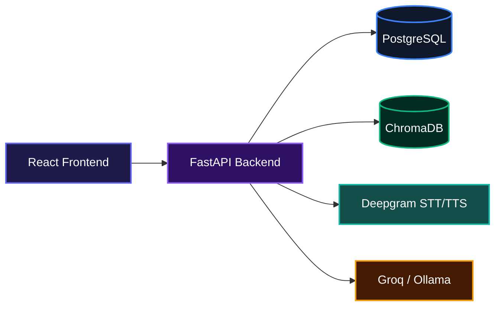
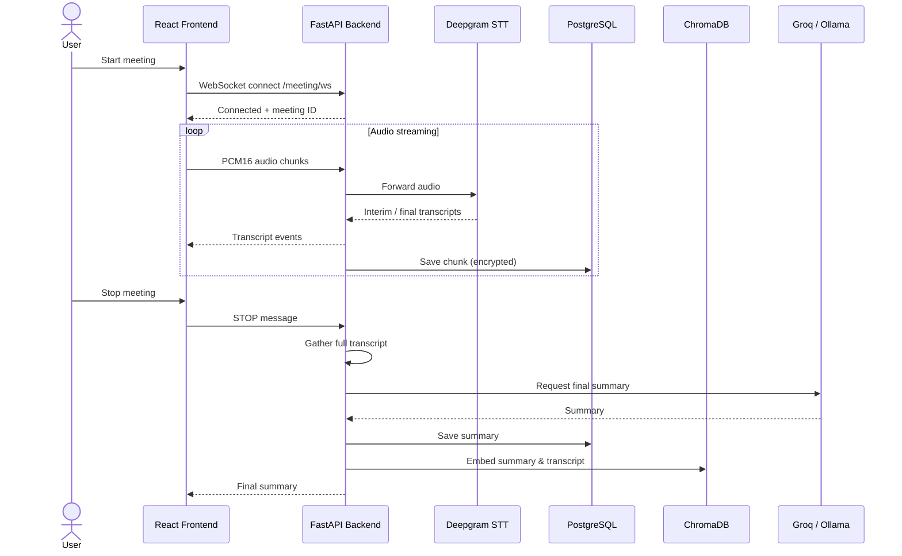
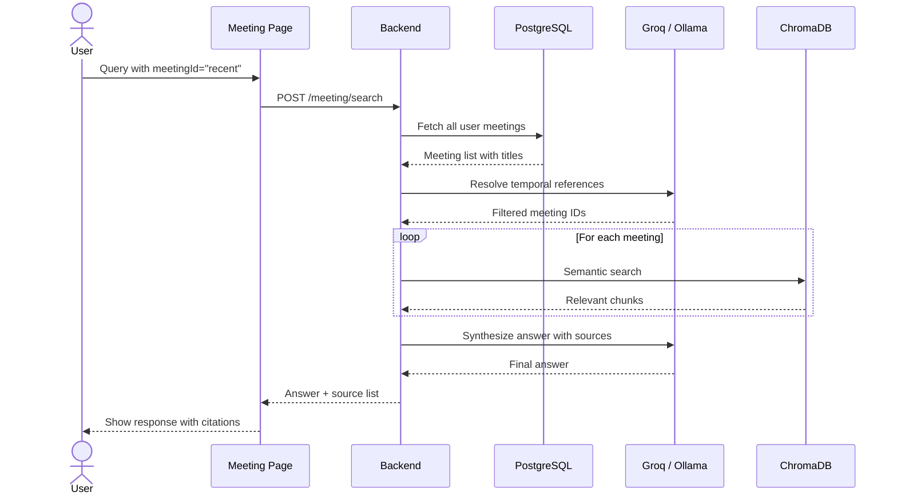

# Kontext Agent

Intelligent meeting and knowledge assistant that captures conversations, transcribes them in real time, and turns spoken words into searchable insights. Kontext delivers live periodic summaries, final structured meeting notes, and lets you chat with your transcripts and uploaded documents, all with accurate context through RAG.

## Overview

Kontext Agent helps you stay on top of meetings by transcribing speech as it happens, generating structured summaries, and making everything searchable. You can ask questions about past meetings or documents, export summaries to email, Notion, or Slack, and keep your knowledge organized without switching between tools. It handles the heavy lifting so you can focus on the conversation.

## System Architecture



## Installation

### Prerequisites

- Python 3.11+
- Node.js 20+
- PostgreSQL (optional for dev, required for production)
- A Deepgram API key, Groq or Ollama credentials
- (Optional) Slack Bot Token for Slack integration

### Backend Setup

1. Clone the repository:

```bash
git clone https://github.com/abeenoch/Kontext-Agent.git
cd Kontext-Agent
```

2. Create environment file from example:

```bash
cp .env.example .env
```

Edit `.env` and set at least `DATABASE_URL`, `GROQ_API_KEY`, `DEEPGRAM_API_KEY`, `JWT_SECRET`.

3. Create and activate a virtual environment:

```bash
python -m venv .venv
source .venv/bin/activate  # On Windows: .venv\Scripts\activate
```

4. Install dependencies:

```bash
pip install -r requirements.txt
```

5. Run the server:

```bash
uvicorn app.main:app --reload --host 0.0.0.0 --port 8000
```

### Frontend Setup

```bash
cd frontend
npm install
npm run dev
```

The frontend runs on `http://localhost:5173` and proxies API requests to the backend.

### Docker

Alternatively, use Docker Compose to spin up everything:

```bash
docker compose up -d
```

Prebuilt images are available on Docker Hub: `lazyghost1/kontext-backend` and `lazyghost1/kontext-frontend`.

## Usage

### Starting a Meeting

Open the frontend, sign up or log in, and navigate to the Meeting page. Click "Start Meeting" to begin capturing audio. The live transcript appears in real time with speaker labels. Periodic summaries are generated automatically every few minutes and the final summary appears when you stop the meeting.

### Interacting with Meetings

While a meeting is active, you can send special commands:

- `ACTION: EMAIL recipient@example.com` to email the current summary
- `ACTION: NOTION` to push the summary to your Notion page
- `ACTION: SLACK` to post the summary to the default Slack channel
- `ACTION: SLACK #channel-name` to post to a specific Slack channel

After a meeting, use the "Chat with Transcript" tab to ask questions about the discussion, request a summary email, export to Notion, or post to Slack. The Summary panel also has one-click buttons for each integration.

### Searching Across Meetings

On the Meeting page, the chat tab supports special meeting IDs like `any`, `recent`, or `latest`. Queries with these IDs automatically trigger a cross-meeting search that resolves temporal references (e.g., "what did we decide last Tuesday?") and returns answers with source meeting titles.

### Document Upload & Chat

Go to the Chat page to upload PDF or TXT files. The documents are chunked and indexed. Any subsequent chat message automatically retrieves relevant context from your knowledge base. You can also clear all documents or monitor ingestion jobs from the sidebar.

### Voice Chat

Connect to the voice chat WebSocket endpoint (`/voice-chat/ws`) to have a real-time spoken conversation with the AI. It transcribes your speech, generates an LLM response, and speaks the answer back using text-to-speech.

### API Quick Start

All endpoints require a Bearer token (except signup and login). Here is an example of asking a question about a meeting:

```bash
curl -X POST http://localhost:8000/meeting/recent/chat \
  -H "Authorization: Bearer $TOKEN" \
  -H "Content-Type: application/json" \
  -d '{"query": "What were the key decisions?"}'
```

## Features

### Real-Time Meeting Transcription with Speaker Diarization

Capture multi-speaker audio and instantly see the transcript with each speaker labeled. Deepgram processes the audio stream and the backend stores every chunk for later retrieval.



### Automated Periodic and Final Summaries

The system automatically generates concise periodic summaries during the meeting and a comprehensive final summary when the meeting ends. Summaries include key takeaways, decisions, action items, deadlines, and risks. All PII is redacted before being sent to the LLM.

### Cross-Meeting Temporal and Semantic Search

Ask natural language questions across all your past meetings. The system first resolves any time references (like "last Monday") to filter relevant meetings, then performs semantic search over those meetings and synthesizes an answer with attribution to source meetings.



### Document Ingestion and RAG Chat

Upload PDFs and text documents. The system chunks, embeds, and indexes them in ChromaDB. When you chat, the backend retrieves the most relevant chunks and injects them into the LLM prompt so answers are grounded in your documents. You can also ask the LLM directly without RAG.

### Data Privacy and Retention

Transcripts and summaries are encrypted at rest using AES-GCM. PII is redacted before any LLM call. Meeting data is automatically pruned after a configurable retention period. Users can hard-delete meeting records and associated embeddings.

### Slack Integration

Post meeting summaries directly to any Slack channel with a single click or natural language command. Summaries are formatted using Slack Block Kit for clean, readable output with a header, section breakdown, and a Kontext Agent footer.

**Setup:**
1. Go to [https://api.slack.com/apps](https://api.slack.com/apps) → **Create New App** → **From scratch**
2. Under **OAuth & Permissions**, add the `chat:write` Bot Token Scope
3. Click **Install to Workspace** and copy the **Bot User OAuth Token** (`xoxb-...`)
4. Invite the bot to your target channel in Slack: `/invite @YourBotName`
5. Set `SLACK_BOT_TOKEN` and `SLACK_DEFAULT_CHANNEL` in your `.env`

**Usage:**
- Click the Slack button in the Summary panel
- Send `ACTION: SLACK` or `ACTION: SLACK #channel-name` over the WebSocket during a meeting
- In the chat tab: *"post this to slack"* or *"send summary to slack #engineering"*

## Technologies Used

| Technology    | Role                                 |
|---------------|--------------------------------------|
| FastAPI       | Backend API framework                |
| Python 3.11+  | Core language                        |
| React 19      | Frontend UI                          |
| Vite          | Frontend build tool                  |
| Tailwind CSS  | Utility-first CSS framework          |
| PostgreSQL    | Relational database (auth, transcripts) |
| ChromaDB      | Vector store for semantic search     |
| Deepgram      | Speech-to-text and text-to-speech    |
| Groq / Ollama  | LLM provider (configurable)          |
| Slack SDK     | Slack Bot integration                |
| OpenTelemetry | Tracing & monitoring                 |
| Prometheus    | Metrics collection                   |
| Docker        | Containerization                     |

## API Documentation

All endpoints are prefixed with the configured base URL (default `http://localhost:8000`). Authentication is via Bearer token (JWT) in the `Authorization` header, except for signup, login, and health routes.

### Auth Routes

#### POST /auth/signup

**Description**: Register a new user.

**Request**:
```json
{
  "email": "user@example.com",
  "password": "min8chars",
  "display_name": "Optional Name"
}
```

**Response**:
```json
{
  "access_token": "jwt...",
  "token_type": "bearer",
  "user_id": "user@example.com",
  "display_name": "Optional Name"
}
```

**Errors**:
- 400: Password too short or invalid email
- 409: Email already exists
- 429: Rate limit exceeded

#### POST /auth/login

**Description**: Authenticate and get a JWT.

**Request**:
```json
{
  "email": "user@example.com",
  "password": "min8chars"
}
```

**Response**:
```json
{
  "access_token": "jwt...",
  "token_type": "bearer",
  "user_id": "user@example.com",
  "display_name": "Name"
}
```

**Errors**:
- 401: Invalid credentials
- 429: Rate limit exceeded

#### POST /auth/forgot-password

**Description**: Request a password reset link (if SMTP configured) or receive a reset token for dev use.

**Request**:
```json
{
  "email": "user@example.com"
}
```

**Response**:
```json
{
  "status": "ok",
  "reset_token": "..."  // only in dev when SMTP is not set
}
```

#### POST /auth/reset-password

**Description**: Reset password using a one-time token.

**Request**:
```json
{
  "token": "reset-token",
  "new_password": "newPassword123"
}
```

**Response**:
```json
{
  "status": "ok"
}
```

**Errors**:
- 400: Invalid/expired token or password too short

### Meeting Routes

#### WS /meeting/ws

**Description**: Real-time meeting transcription via WebSocket. Send binary PCM16 audio frames and receive JSON transcript events. Supports `STOP` command to end the meeting and generate a final summary, `ACTION: EMAIL <addr>`, `ACTION: NOTION`, and `ACTION: SLACK [#channel]` for exports. Also accepts `{"type":"config","sample_rate":16000}` to adjust audio format.

**Authentication**: Query parameter `?token=` or Bearer token in header.

**Messages sent by server**:
- `{"type": "connected", "meeting_id": "..."}`
- `{"type": "transcript", "text": "...", "speaker": 1, "timestamp": "12:34"}`
- `{"type": "interim", "text": "..."}`
- `{"type": "periodic_summary", "summary": "..."}`
- `{"type": "final_summary", "summary": "..."}`
- `{"type": "status", "message": "..."}`
- `{"type": "error", "message": "..."}`

#### POST /meeting/search

**Description**: Cross-meeting temporal & semantic search.

**Request**:
```json
{
  "query": "what did we decide last Tuesday?",
  "date_hint": null
}
```

**Response**:
```json
{
  "answer": "The team decided...",
  "sources": [
    {
      "meeting_id": "abc123",
      "title": "Strategy Review",
      "started_at": "2025-04-07T14:00:00+00:00"
    }
  ],
  "temporal_range": "Tuesday Apr 7"
}
```

**Errors**:
- 422: Empty query

#### GET /meeting/history

**Description**: List recent meetings with titles and summary status.

**Response**:
```json
[
  {
    "meeting_id": "abc123",
    "started_at": "2025-04-07T14:00:00+00:00",
    "has_summary": true,
    "title": "Strategy Review"
  }
]
```

#### GET /meeting/{meeting_id}/transcript

**Description**: Fetch a meeting's full transcript.

**Response**:
```json
{
  "meeting_id": "abc123",
  "transcript": "Full text..."
}
```

**Errors**:
- 404: Transcript not found

#### GET /meeting/{meeting_id}/summary

**Description**: Fetch a meeting's summary.

**Response**:
```json
{
  "meeting_id": "abc123",
  "summary": "## Overview ..."
}
```

#### DELETE /meeting/{meeting_id}

**Description**: Hard delete a meeting's transcript, summaries, and embeddings.

**Response**:
```json
{
  "status": "deleted",
  "meeting_id": "abc123"
}
```

#### POST /meeting/{meeting_id}/chat

**Description**: Chat with a meeting's transcript using RAG. If `meeting_id` is `recent`, `any`, or `latest`, delegates to cross-meeting search. Supports voice input via base64 PCM audio.

**Request**:
```json
{
  "query": "who was assigned the marketing task?",
  "voice_audio": null
}
```

**Response**:
```json
{
  "response": "Priya was assigned...",
  "audio": null
}
```

**Errors**:
- 404: Meeting not found
- 400: Empty query
- 503: LLM unavailable

### Chat Routes

#### POST /chat/query

**Description**: General chat with RAG and conversation memory. If documents have been uploaded, the backend includes relevant chunks.

**Request**:
```json
{
  "query": "explain the onboarding flow",
  "tab_id": "default",
  "voice_audio": null
}
```

**Response**:
```json
{
  "response": "The onboarding flow...",
  "sources_used": true
}
```

**Errors**:
- 400: Empty query
- 502/503: LLM errors

#### DELETE /chat/history

**Description**: Clear all chat history for the authenticated user.

**Response**:
```json
{
  "status": "cleared"
}
```

### Document Routes

#### POST /docs/upload

**Description**: Upload and ingest a PDF or TXT file (max 300 MB). Returns a job ID for polling. In development, ingestion runs synchronously; in production, it's processed in the background.

**Request**: multipart/form-data with fields `file` (required) and `tab_id` (optional, default "default").

**Response** (sync ingestion):
```json
{
  "filename": "report.pdf",
  "status": "ingested",
  "job_id": "uuid",
  "chunks_ingested": 12
}
```

**Response** (async ingestion):
```json
{
  "filename": "report.pdf",
  "status": "queued",
  "job_id": "uuid"
}
```

#### GET /docs/status/{job_id}

**Description**: Check the status of an ingestion job.

**Response**:
```json
{
  "id": "uuid",
  "filename": "report.pdf",
  "status": "completed",
  "chunks_ingested": 12,
  "error": null
}
```

#### POST /docs/chat

**Description**: Chat with uploaded documents. Optionally bypass RAG with `use_rag: false`. Supports voice input.

**Request**:
```json
{
  "query": "what is the revenue forecast?",
  "voice_audio": null,
  "use_rag": true,
  "job_id": null
}
```

**Response**:
```json
{
  "response": "The revenue forecast...",
  "sources_used": true
}
```

**Errors**:
- 400: Empty query
- 404: Referenced ingestion job not found
- 425: Ingestion job not yet completed
- 502/503: LLM errors

#### DELETE /docs/clear

**Description**: Delete all uploaded documents and their embeddings for the authenticated user.

**Response**:
```json
{
  "status": "cleared"
}
```

### Metrics

#### GET /metrics

**Description**: Prometheus metrics endpoint (LLM latency, token usage, errors, in-flight calls). Requires `prometheus-client` to be installed.

### Voice Chat

#### WS /voice-chat/ws

**Description**: Real-time voice conversation. The server transcribes the user's speech, generates an LLM answer, and returns TTS audio.

**Messages received**:
- Base64-encoded PCM16 audio chunks
- `"STOP"` to end the session

**Messages sent**:
- `{"type": "interim_transcript", "text": "..."}`
- `{"type": "final_transcript", "text": "..."}`
- `{"type": "llm_response", "text": "..."}`
- `{"type": "tts_audio", "audio": "base64...", "format": "mp3"}`
- `{"type": "error", "message": "..."}`

### Health Check

#### GET /

**Response**:
```json
{
  "name": "Kontext Agent",
  "version": "1.0.0",
  "status": "running",
  "docs": "/docs"
}
```

#### GET /health

**Response**:
```json
{
  "status": "ok"
}
```

### Environment Variables

| Variable | Purpose | Required |
|----------|---------|----------|
| `DATABASE_URL` | Async SQLAlchemy URI (Postgres or SQLite) | Yes |
| `JWT_SECRET` | Secret for signing JWTs (min 32 chars in prod) | Yes |
| `DEEPGRAM_API_KEY` | Deepgram API key for STT/TTS | Yes |
| `GROQ_API_KEY` | Groq API key for LLM calls | Required if provider is groq |
| `LLM_PROVIDER` | Choose `groq` or `ollama` | Yes |
| `ENCRYPTION_KEY` | Key for AES-GCM encryption of transcripts (falls back to `JWT_SECRET`) | Optional |
| `SMTP_HOST` / `SMTP_USER` / `SMTP_PASS` | SMTP credentials for email summaries | Optional |
| `NOTION_TOKEN` | Notion integration token | Optional |
| `NOTION_PAGE_ID` | Notion parent page ID to create summary pages under | Optional |
| `SLACK_BOT_TOKEN` | Slack Bot User OAuth Token (`xoxb-...`) | Optional |
| `SLACK_DEFAULT_CHANNEL` | Default Slack channel to post summaries to (e.g. `#general`) | Optional |
| `CORS_ORIGINS` | Comma-separated allowed origins | Yes (production) |
| `FRONTEND_URL` | Frontend URL for password reset link | Optional |
| `CHROMA_DIR` | Directory for ChromaDB persistence | Yes |
| `EMBEDDING_MODEL` | Sentence‑transformers model name | Optional |
| `APP_ENV` | `development`, `production`, or `test` | Optional |

See `.env.example` for the full list and default values.

## Contributing

Contributions are welcome. Fork the repository, create a feature branch, and open a pull request. For major changes, please open an issue first to discuss what you would like to change.

Backend tests can be run with:

```bash
pytest
```

Frontend code follows standard ESLint rules; run:

```bash
cd frontend
npm run lint
```

## Author

- X (Twitter): [https://x.com/industryshark](https://x.com/industryshark)

## Badges

[](https://dokugen.samueltuoyo.com)